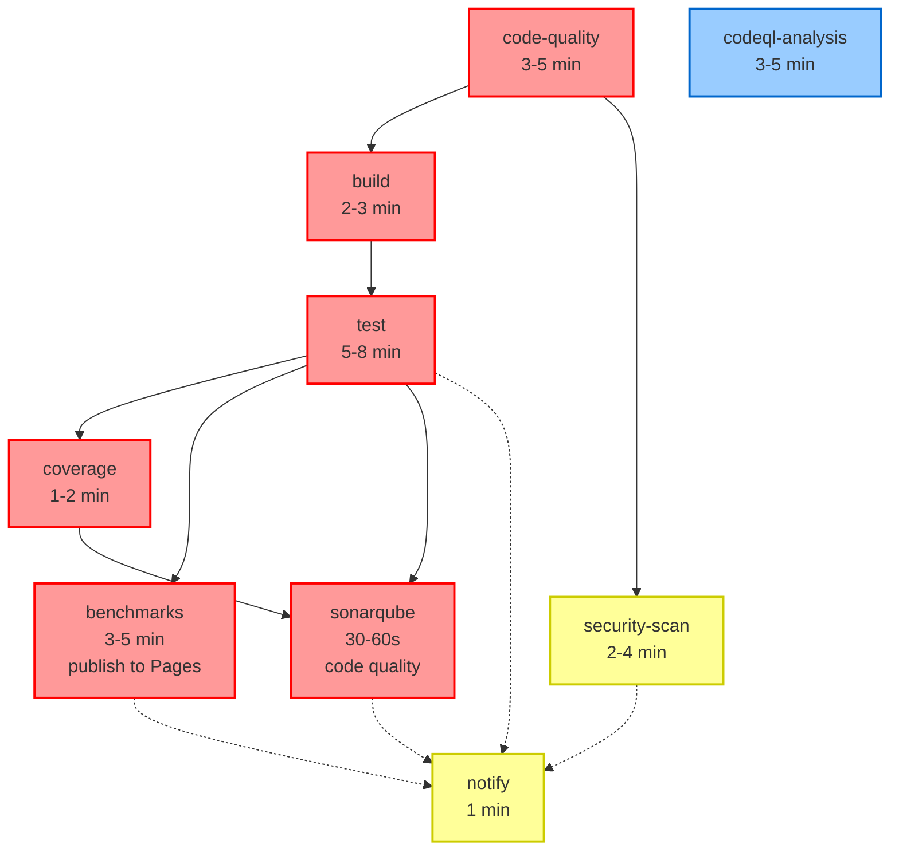

# Password Vault CLI

A secure, offline, open-source CLI password vault with local-only encryption, designed for developers and security-conscious users.

## 🔐 Features

- **Local-Only**: No network connectivity, sync, or telemetry
- **Strong Encryption**: Argon2id KDF + AES-256-GCM AEAD
- **Profile Support**: Organize passwords by environment (dev/prod/personal)
- **Cross-Platform**: Works on macOS, Linux, and Windows
- **Secure by Design**: Zero trust architecture, tamper detection
- **CLI Interface**: Fast, scriptable command-line interface
- **Clipboard Integration**: Auto-clearing clipboard support
- **Audit Logging**: Tamper-evident operation history
- **Export/Import**: Encrypted backup and restore

## 🚀 Quick Start

### Installation

#### From Source (Recommended)

```bash
# Clone the repository
git clone https://github.com/vault-cli/vault.git
cd vault

# Build the binary
make build

# Install to system PATH
sudo make install
```

#### Prerequisites

- Go 1.21 or later
- Git

### Basic Usage

```bash
# Initialize a new vault
vault init

# Unlock the vault
vault unlock

# Add your first password
vault add github --username myuser --url https://github.com

# Retrieve a password (copies to clipboard)
vault get github --copy

# List all entries
vault list

# Lock the vault when done
vault lock
```

## 📖 Documentation

- [Usage Guide](docs/USAGE.md) - Detailed command examples
- [Architecture](docs/ARCHITECTURE.md) - System design and components
- [Security Model](SECURITY.md) - Threat model and cryptographic choices
- [Contributing](CONTRIBUTING.md) - Development setup and guidelines

## 🛡️ Security

This password vault is designed with security as the primary concern:

- **Argon2id KDF**: Memory-hard key derivation (~300ms default)
- **AES-256-GCM**: NIST-approved authenticated encryption
- **Unique Nonces**: CSPRNG-generated, never reused
- **File Permissions**: Vault files locked to 0600 (owner-only)
- **Memory Protection**: Sensitive data zeroized after use
- **Tamper Detection**: Cryptographic integrity verification

### Security Validation

Run the security test suite:

```bash
make test-security
make test-fuzz
make test-acceptance
```

See [SECURITY_VALIDATION.md](docs/SECURITY_VALIDATION.md) for detailed test results.

## 🔧 Commands

| Command | Description |
|---------|-------------|
| `init` | Initialize a new vault |
| `unlock` | Unlock vault for access |
| `lock` | Lock vault and clear session |
| `add <entry>` | Add new password entry |
| `get <entry>` | Retrieve password entry |
| `list` | List all entries |
| `update <entry>` | Update existing entry |
| `delete <entry>` | Delete entry |
| `profiles` | Manage profiles |
| `export` | Export encrypted backup |
| `import` | Import from backup |
| `doctor` | Run security health checks |
| `config` | Manage configuration |

## 📁 Configuration

Default configuration locations:

- **Linux/macOS**: `~/.config/vault/config.yaml`
- **Windows**: `%APPDATA%\vault\config.yaml`

Example configuration:

```yaml
vault_path: ~/.local/share/vault/vault.db
default_profile: default
session_timeout: 1800  # 30 minutes
clipboard_timeout: 30  # 30 seconds
profiles:
  default:
    name: default
    auto_lock: 300
  production:
    name: production
    auto_lock: 60
```

## 🏗️ Development

### Build from Source

```bash
# Clone repository
git clone https://github.com/vault-cli/vault.git
cd vault

# Install dependencies
go mod download

# Run tests
make test

# Build binary
make build

# Run security tests
make test-security

# Run demo examples
make demo-crypto     # Cryptography features
make demo-storage    # Storage layer
make demo-all        # All demos
```

### Project Structure

```
.
├── cmd/vault/           # CLI entry point
├── internal/
│   ├── cli/            # Command implementations
│   ├── vault/          # Cryptographic engine
│   ├── store/          # Storage layer
│   ├── domain/         # Data models
│   ├── config/         # Configuration
│   └── util/           # Utilities
├── tests/              # Test suites
├── docs/               # Documentation
└── Makefile           # Build system
```

## 🧪 Testing

Comprehensive test suite with >90% coverage:

```bash
# Run all tests
make test

# Run specific test suites
make test-unit          # Unit tests
make test-integration   # Integration tests
make test-security      # Security scenarios
make test-fuzz          # Fuzz testing
make test-acceptance    # End-to-end workflows

# Generate coverage report
make coverage
```

## 📊 Performance

Typical performance characteristics:

- **Key Derivation**: ~300ms (tunable)
- **Encryption**: <1ms per entry
- **Database Operations**: <5ms per operation
- **Startup Time**: <100ms

**Live Benchmarks**: View detailed performance benchmarks and historical trends at our [GitHub Pages benchmark dashboard](https://vault-cli.github.io/vault/previews/master/latest/).

**Documentation**:
- [Benchmark Publishing System](docs/BENCHMARK_PUBLISHING.md) - Architecture and workflow
- [Testing Benchmarks](docs/TESTING_BENCHMARKS.md) - Testing guide and scenarios

## 🔒 Threat Model

This vault protects against:

- ✅ Unauthorized vault access
- ✅ Data exfiltration from disk
- ✅ Memory dumps and swap files
- ✅ Brute force attacks
- ✅ Dictionary attacks
- ✅ File tampering
- ✅ Timing attacks

**Out of Scope:**
- Physical access to unlocked system
- Keyloggers and screen capture
- OS-level privilege escalation
- Hardware attacks (cold boot, etc.)

## 📝 License

MIT License - see [LICENSE](LICENSE) for details.

## 🤝 Contributing

We welcome contributions! Please see [CONTRIBUTING.md](CONTRIBUTING.md) for:

- Development setup
- Code style guidelines
- Testing requirements
- Security considerations
- Pull request process

## 🆘 Support

- **Issues**: [GitHub Issues](https://github.com/vault-cli/vault/issues)
- **Security**: Report security issues to security@vault-cli.dev
- **Documentation**: [docs/](docs/) directory

## 🎯 Roadmap

- [ ] TOTP/2FA support
- [ ] Hardware security key integration
- [ ] Mobile companion app
- [ ] Browser extension
- [ ] Team sharing (encrypted)
- [ ] Backup to cloud storage

## ⚡ Quick Examples

```bash
# Initialize and setup
vault init --kdf-memory 128 --kdf-iterations 5
vault unlock --ttl 2h

# Add entries with different methods
vault add github --username user@example.com --secret-prompt
vault add aws --username admin --secret-file ~/.aws/secret
vault add db --username root --url postgres://localhost:5432

# Organize with profiles
vault profiles create production "Production environment"
vault --profile production add prod-db --username admin

# Search and retrieve
vault list --tags work,development
vault get github --field password --copy
vault get aws --show  # Display without copying

# Maintenance
vault doctor  # Security health check
vault export --encrypted backup.vault
vault rotate-master-key
```

---

**⚠️ Security Notice**: Always keep your master passphrase secure and create regular encrypted backups. This tool stores passwords locally and cannot recover lost master passphrases.
## 🔄 CI/CD Pipeline

This project uses GitHub Actions for continuous integration and continuous deployment. The pipeline is designed to ensure code quality, security, performance, and reliability across all changes.

### 📊 Pipeline Overview

The CI/CD pipeline consists of 9 interconnected stages that run automatically on pushes and pull requests:

```
                                    ┌────────────────────┐
                                    │    code-quality    │
                                    │ (lint, vet, gosec) │
                                    └─────────┬──────────┘
                                              │
                ┌─────────────────────────────┴────────────────────────────┐
                ▼                                                          ▼
       ┌────────────────────┐                                     ┌────────────────────┐
       │       build        │                                     │   security-scan    │
       │ (Linux / macOS /   │                                     │       (Trivy)      │
       │   Windows matrix)  │                                     └─────────┬──────────┘
       └─────────┬──────────┘                                               │
                 │                                                          │
                 ▼                                                          ▼
       ┌────────────────────┐                                        (artifact / SARIF)
       │        test        │                                               │
       │ (unit / race / cov)│                                               │
       └─────────┬──────────┘                                               │
                 │                                                          │
       ┌─────────┴───────────────────┐                                      │
       ▼                             ▼                                      │
┌────────────────────┐  ┌────────────────────┐                              │
│      coverage      │  │     benchmarks     │                              │
│      (Codecov)     │  │ (publish to Pages) │                              │
└──────┬─────────────┘  └────────────┬───────┘                              │
       │                             │                                      │
       │     ┌────────────────────┐  │                                      │
       └────►│  sonarqube-analysis│  │                                      │
             │  (code quality)    │  │                                      │
             └───────────┬────────┘  │                                      │
                         │           │                                      │
                         ▼           ▼                                      │
                        ┌────────────────────┐                              │ 
                        │       notify       │◄─────────────────────────────┘      
                        │  (GitHub Issue)    │
                        └────────────────────┘


Parallel / Independent:
  ┌───────────────────────────┐
  │     CodeQL Analysis       │
  └───────────────────────────┘

```

### 🚀 Triggers

The pipeline automatically triggers on:

| Event | Conditions | Actions |
|-------|------------|---------|
| **Push** | To `main` or `develop` branches | Runs all stages |
| **Pull Request** | To `main` or `develop` branches | Runs all stages except notify |
| **Tag** | Pattern `v*` (e.g., `v1.0.0`) | Runs all stages |
| **Manual** | Via GitHub Actions UI | Runs all stages |

**Parallel Execution:**
- `codeql-analysis` runs independently (parallel to all)
- `security-scan` runs after `code-quality` (parallel to build/test)
- `benchmarks` runs parallel to `coverage` (both after `test`)

**Critical Path:**
`code-quality` → `build` → `test` → `coverage` → `sonarqube`
Total critical path time: ~12-20 minutes

**All Stages Complete When:**
- Critical path finishes (`sonarqube` completes)
- `benchmarks` completes (parallel to coverage)
- `security-scan` completes
- `notify` runs only on failures

### 🎯 Visual Dependency Graph (Mermaid)



**Legend:**
- 🔴 **Critical Path**: Must complete sequentially
- 🔵 **Parallel**: Runs independently 
- 🟡 **Optional**: Conditional or non-blocking

**Execution Groups:**
1. **Group 1** (Start): `code-quality`, `codeql-analysis`
2. **Group 2**: `build`, `security-scan` (after `code-quality`)
3. **Group 3**: `test` (after `build`)
4. **Group 4**: `coverage`, `benchmarks` (after `test`)
5. **Group 5**: `sonarqube` (after `coverage`)
6. **Group 6**: `notify` (on failure only)

### 📋 Detailed Stage Breakdown

#### 1. Code Quality (`code-quality`)
**Purpose**: Ensures code follows Go best practices and style guidelines

**Tools & Versions**:
- `golangci-lint`: v1.54.2
- `gofmt`: Built-in Go formatter
- `goimports`: v0.13.0
- `gofumpt`: v0.5.0
- `staticcheck`: 2023.1.6
- `gosec`: v2.19.0

**Matrix**:
- Go versions: 1.24.10
- OS: ubuntu-latest

**Checks Performed**:
- Code formatting (gofmt, goimports, gofumpt)
- Linting with 50+ linters
- Static analysis for bugs and inefficiencies
- Security vulnerability scanning

**Dependencies**: None (first stage)
**Runtime**: ~3-5 minutes

#### 2. Build (`build`)
**Purpose**: Compiles the binary for multiple platforms

**Matrix**:
| OS | Architecture | Binary Name |
|----|---------------|--------------|
| Linux | amd64 | vault-linux-amd64 |
| Linux | arm64 | vault-linux-arm64 |
| macOS | amd64 | vault-darwin-amd64 |
| macOS | arm64 | vault-darwin-arm64 |
| Windows | amd64 | vault-windows-amd64.exe |

**Dependencies**: `code-quality`
**Runtime**: ~2-3 minutes

#### 3. Test (`test`)
**Purpose**: Runs unit and integration tests with race detection

**Tools & Versions**:
- Go test runner: 1.24.10
- Coverage mode: atomic

**Matrix**:
- Go versions: 1.24.10
- OS: ubuntu-latest

**Tests Performed**:
- Unit tests with `-race` flag
- Integration tests
- Coverage report generation
- Binary verification

**Dependencies**: `build`
**Runtime**: ~5-8 minutes

#### 4. CodeQL Analysis (`codeql-analysis`)
**Purpose**: Advanced security vulnerability scanning

**Tools & Versions**:
- CodeQL: v2.15.3
- Languages: Go
- Queries: security-extended, security-and-quality

**Dependencies**: None (runs in parallel)
**Runtime**: ~3-5 minutes

#### 5. Coverage (`coverage`)
**Purpose**: Uploads test coverage to Codecov for tracking

**Tools & Versions**:
- codecov-action: v3.1.4
- Coverage file: coverage.out

**Dependencies**: `test`
**Runtime**: ~1-2 minutes

#### 6. Benchmarks (`benchmarks`)
**Purpose**: Runs performance benchmarks, detects regressions, and publishes results to GitHub Pages

**Tools & Versions**:
- Go benchmark runner: 1.24.10
- benchstat: golang.org/x/perf/cmd/benchstat
- peaceiris/actions-gh-pages: v3

**Configuration**:
- Count: 3 iterations per benchmark
- Regression threshold: 10% degradation
- Archive retention: Last 10 versions

**Regression Strategy**:
| Context | Baseline | Action | Purpose |
|---------|----------|--------|---------|
| **PR Commits** | Previous commit in same PR | Informational only | Track incremental changes |
| **Main Branch** | Current master baseline | **BLOCKS on regression** | Protect main from regressions |

**Published Results**:
- **Master**: `https://<username>.github.io/<repo>/previews/master/latest/`
- **PRs**: `https://<username>.github.io/<repo>/previews/pull-requests/pr-N/latest/`

**Directory Structure**:
```
previews/
├── master/
│   ├── latest/          # Current main branch benchmarks
│   └── old/             # Archived versions (last 10)
└── pull-requests/
    └── pr-N/
        ├── latest/      # Current PR benchmarks
        └── old/         # Archived commits (last 10)
```

**Features**:
- ✅ Automated benchmark execution on every commit
- ✅ Smart regression detection (PRs: informational, main: blocking)
- ✅ Version history with archiving (keep last 10)
- ✅ GitHub Pages deployment with navigation
- ✅ PR comments with benchmark links
- ✅ Organized by master/pull-requests

**Documentation**:
- [Benchmark Publishing Guide](docs/BENCHMARK_PUBLISHING.md) - System architecture
- [Testing Benchmarks](docs/TESTING_BENCHMARKS.md) - Testing guide with scenarios

**Dependencies**: `test`
**Runtime**: ~3-5 minutes

#### 7. SonarQube Analysis (`sonarqube`)
**Purpose**: Static code analysis for code quality, bugs, and security vulnerabilities

**Tools & Versions**:
- SonarQube Scanner: v6.0.0
- Analysis platform: SonarCloud/SonarQube

**Configuration**:
- Project key: `ayush1452_password-vault-cli`
- Organization: `ayush1452`
- Coverage integration: Uses `coverage.out` from test stage
- Test reports: `test-report.xml`

**Analysis Scope**:
- **Code Quality**: Maintainability, reliability, and technical debt
- **Security**: Security hotspots and vulnerabilities
- **Coverage**: Test coverage metrics and trends
- **Duplications**: Code duplication detection
- **Complexity**: Cyclomatic complexity analysis

**Quality Gates**:
- Minimum coverage threshold
- No new critical/blocker issues
- Security rating requirements
- Maintainability rating requirements

**Dependencies**: `test`, `coverage`
**Runtime**: ~30-60 seconds

#### 8. Security Scan (`security-scan`)
**Purpose**: Additional vulnerability scanning with Trivy

**Tools & Versions**:
- Trivy: v0.45.1
- Scan type: Filesystem
- Output format: SARIF

**Scopes**:
- Source code vulnerabilities
- Dependency vulnerabilities
- Configuration issues

**Dependencies**: `code-quality`
**Runtime**: ~2-4 minutes

#### 9. Notify (`notify`)
**Purpose**: Creates GitHub issues for pipeline failures

**Triggers**: Only on push failures (not PRs)

**Issue Details**:
- Title: "CI/CD Pipeline Failed: [workflow-name]"
- Labels: ci-failure, bug
- Body includes:
  - Failed jobs list
  - Commit details
  - Links to workflow run
  - Troubleshooting steps

**Dependencies**: `test`, `benchmarks`, `security-scan`, `sonarqube`
**Runtime**: ~1 minute

### 🔗 Dependencies Flow

```
Stage Dependencies:
├── code-quality (independent)
├── codeql-analysis (independent)
├── build → code-quality
├── test → build
├── coverage → test
├── benchmarks → test
├── sonarqube → test, coverage
├── security-scan → code-quality
└── notify → test, benchmarks, security-scan, sonarqube
```

### ⚡ Performance Optimizations

1. **Caching**: Go modules and build caches are reused between runs
2. **Parallel Execution**: Independent stages run simultaneously
3. **Matrix Builds**: Efficient multi-platform builds
4. **Fail-Fast Disabled**: Continue testing other versions on failure

### 🔧 Version Management

| Component | Version | Update Strategy |
|-----------|---------|-----------------|
| Go | 1.24.10 | Manual (security updates) |
| golangci-lint | v1.54.2 | Monthly |
| CodeQL | v2.15.3 | Auto (GitHub managed) |
| Trivy | v0.45.1 | Monthly |
| codecov-action | v3.1.4 | Quarterly |

### 🚨 Common Issues & Solutions

#### Issue 1: Go Module Cache Miss
**Symptoms**: Slow builds, repeated downloads
**Causes**: Cache key mismatch, cache corruption
**Solutions**:
```bash
# Clear local cache
go clean -modcache

# In CI: Check cache key format
key: ${{ runner.os }}-go-${{ matrix.go-version }}-${{ hashFiles('**/go.sum') }}
```

#### Issue 2: Benchmark Regression False Positives
**Symptoms**: Performance check fails on unrelated changes
**Causes**: Noisy CI environment, insufficient benchmark iterations
**Solutions**:
- Increase benchmark count to 5
- Use statistical significance testing
- Add performance tolerance margin

#### Issue 3: Security Scan Timeouts
**Symptoms**: Trivy scan exceeds timeout
**Causes**: Large dependency tree, network issues
**Solutions**:
```yaml
# Add timeout to security-scan
timeout-minutes: 10
# Use cache for Trivy DB
- name: Cache Trivy DB
  uses: actions/cache@v3
  with:
    path: ~/.cache/trivy
    key: trivy-${{ runner.os }}-db
```

#### Issue 4: Coverage Upload Failures
**Symptoms**: Codecov upload fails
**Causes**: Invalid token, network issues, malformed coverage
**Solutions**:
- Verify CODECOV_TOKEN in repository secrets
- Check coverage file format: `go tool cover -func=coverage.out`
- Use fail_ci_if_error: false for debugging

#### Issue 5: Race Condition Failures
**Symptoms**: Tests fail with race detector
**Causes**: Concurrent access to shared resources
**Solutions**:
- Use `sync.Mutex` for shared state
- Review test isolation
- Add `-race` flag locally for debugging

### 🔍 Debugging Pipeline Issues

#### Local Testing Commands

```bash
# Run full CI locally
./scripts/ci-local.sh

# Run individual stages
make lint
make test
make benchmark
make security-scan

# Debug specific issues
go test -race -v ./...
golangci-lint run --verbose
trivy fs --format sarif .
```

#### CI Debugging Tips

1. **Enable Debug Logging**:
   ```yaml
   env:
     ACTIONS_STEP_DEBUG: true
     ACTIONS_RUNNER_DEBUG: true
   ```

2. **Download Artifacts**:
   - Coverage reports
   - Benchmark results
   - Build artifacts
   - Security scan results

3. **Check Job Logs**:
   - Focus on the "Set up" steps
   - Verify environment variables
   - Check network connectivity

### 📊 Metrics and Monitoring

#### Tracked Metrics
- Test coverage percentage
- Benchmark performance trends
- Security vulnerability count
- Build success rate
- Pipeline duration

#### Alerts Configuration
- Performance regression >10%
- Coverage drop >5%
- New security vulnerabilities
- Build failure rate >20%

### 🔄 Maintenance Tasks

#### Monthly
- Update golangci-lint version
- Review and update linter rules
- Check Trivy database freshness

#### Quarterly
- Update Go version (if new stable)
- Review CodeQL queries
- Update action versions
- Audit pipeline dependencies

#### Annually
- Review entire pipeline architecture
- Optimize for performance
- Update documentation
- Security audit of CI configuration

### 🚀 Future Enhancements

1. **Integration Tests**: Add end-to-end testing
2. **Dependency Updates**: Automated dependabot PRs
3. **Release Automation**: Tag-based releases
4. **Multi-Region Testing**: Geo-distributed testing
5. **Performance Baselines**: Historical performance tracking

### 📞 Support

For CI/CD issues:
1. Check this documentation first
2. Review workflow logs in GitHub Actions
3. Search existing issues
4. Create new issue with:
   - Workflow run ID
   - Failed stage name
   - Error logs
   - Steps to reproduce


