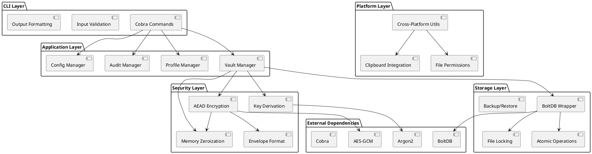
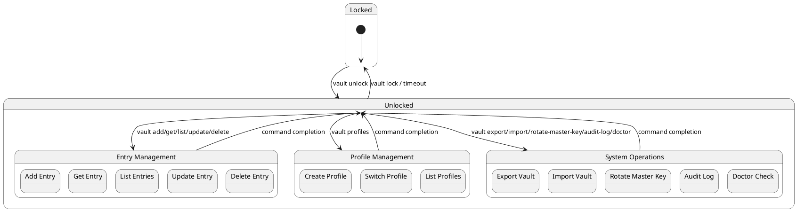
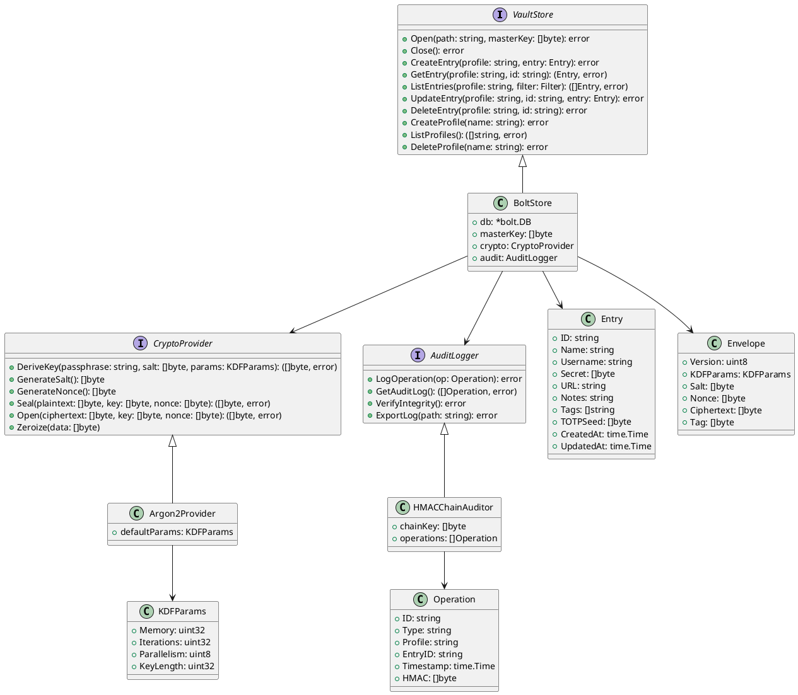
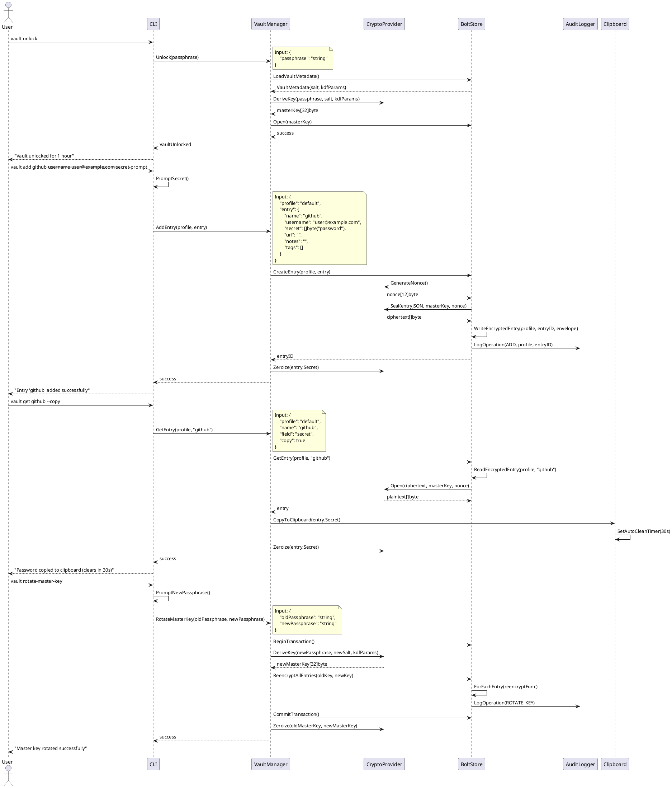

# Password Vault CLI - Architecture Design

## Overview

The Password Vault CLI is a local-only, encrypted password management system designed with zero-trust principles. It provides secure storage of credentials with strong cryptographic guarantees, profile-based organization, and comprehensive audit capabilities.

## Implementation Approach

We will implement the following core components:

1. **Cryptographic Layer** - Argon2id KDF + AEAD encryption (AES-256-GCM/XChaCha20-Poly1305)
2. **Storage Engine** - BoltDB with record-level encryption and atomic operations
3. **CLI Interface** - Cobra-based command system with secure input handling
4. **Profile Management** - Namespace isolation for different environments
5. **Audit System** - HMAC-chained operation logging for tamper detection
6. **Configuration Management** - Secure defaults with tunable parameters

### Key Design Principles

- **Zero Trust**: Treat filesystem as hostile; detect tampering
- **Local-Only**: No network communication or telemetry
- **Fail-Safe**: Cryptographic operations fail closed
- **Atomic Operations**: All state changes are transactional
- **Memory Safety**: Immediate zeroization of sensitive data

## Main User-UI Interaction Patterns

### Primary Workflows

1. **Initial Setup**
   ```bash
   vault init --kdf-memory 64 --kdf-iterations 3 --kdf-parallelism 4
   ```

2. **Daily Usage**
   ```bash
   vault unlock --ttl 3600
   vault add github --username user@example.com --secret-prompt
   vault get github --copy
   vault lock
   ```

3. **Profile Management**
   ```bash
   vault profiles create production
   vault --profile production add prod-db --username admin --secret-prompt
   ```

4. **Backup & Recovery**
   ```bash
   vault export --encrypted backup.vault
   vault import backup.vault --conflict overwrite
   ```

## System Architecture



## UI Navigation Flow



## Data Structures and Interfaces



## Program Call Flow



## Storage Schema Design

### BoltDB Bucket Structure

```
vault.db
├── metadata/
│   ├── version          -> "1.0.0"
│   ├── kdf_params       -> {memory: 65536, iterations: 3, parallelism: 4}
│   ├── salt             -> [32]byte
│   └── created_at       -> timestamp
├── profiles/
│   ├── default          -> {created_at, description}
│   ├── production       -> {created_at, description}
│   └── development      -> {created_at, description}
├── entries:default/
│   ├── github           -> Envelope{version, nonce, ciphertext, tag}
│   ├── aws              -> Envelope{version, nonce, ciphertext, tag}
│   └── database         -> Envelope{version, nonce, ciphertext, tag}
├── entries:production/
│   └── prod-db          -> Envelope{version, nonce, ciphertext, tag}
├── audit/
│   ├── operations       -> []Operation (HMAC chained)
│   ├── chain_key        -> [32]byte (encrypted with master key)
│   └── last_hmac        -> [32]byte
└── config/
    ├── default_profile  -> "default"
    ├── auto_lock_ttl    -> 3600
    └── clipboard_ttl    -> 30
```

### Envelope Format

```go
type Envelope struct {
    Version    uint8    `json:"v"`           // Format version (1)
    Nonce      []byte   `json:"n"`           // 12 bytes for AES-GCM
    Ciphertext []byte   `json:"c"`           // Encrypted entry JSON
    Tag        []byte   `json:"t"`           // 16 bytes authentication tag
}
```

### Entry JSON Structure (before encryption)

```json
{
    "id": "uuid-v4",
    "name": "github",
    "username": "user@example.com",
    "secret": "password123",
    "url": "https://github.com",
    "notes": "Personal GitHub account",
    "tags": ["work", "git"],
    "totp_seed": "base32-encoded-seed",
    "created_at": "2024-01-01T00:00:00Z",
    "updated_at": "2024-01-01T00:00:00Z"
}
```

## CLI Command Specifications

### Core Commands

#### `vault init`
```bash
vault init [flags]

Flags:
  --kdf-memory uint32      Memory parameter for Argon2id (KB) (default: 65536)
  --kdf-iterations uint32  Time parameter for Argon2id (default: 3)
  --kdf-parallelism uint8  Parallelism parameter for Argon2id (default: 4)
  --force                  Overwrite existing vault
```

#### `vault unlock`
```bash
vault unlock [flags]

Flags:
  --ttl duration    Auto-lock timeout (default: 1h)
```

#### `vault add`
```bash
vault add <entry-name> [flags]

Flags:
  --username string      Username/email
  --secret-prompt        Prompt for secret interactively
  --secret-file string   Read secret from file
  --url string          Associated URL
  --notes string        Additional notes
  --tags strings        Comma-separated tags
  --totp-seed string    TOTP seed (base32)
```

#### `vault get`
```bash
vault get <entry-name> [flags]

Flags:
  --field string    Field to retrieve (secret|username|url|notes) (default: "secret")
  --copy           Copy to clipboard instead of displaying
  --show           Show secret in terminal (security warning)
```

#### `vault profiles`
```bash
vault profiles <command> [args]

Commands:
  create <name>           Create new profile
  delete <name>           Delete profile
  list                    List all profiles
  rename <old> <new>      Rename profile
  set-default <name>      Set default profile
```

### Security Commands

#### `vault rotate-master-key`
```bash
vault rotate-master-key

Interactive command that:
1. Prompts for current passphrase
2. Prompts for new passphrase (with confirmation)
3. Re-encrypts all entries with new key
4. Updates vault metadata
```

#### `vault audit-log`
```bash
vault audit-log [flags]

Flags:
  --show              Display audit log
  --verify            Verify HMAC chain integrity
  --export string     Export audit log to file
```

#### `vault doctor`
```bash
vault doctor

Performs security checks:
- File permissions (vault should be 0600)
- KDF parameter strength
- Vault integrity
- Configuration security
```

## Transaction Policy and Concurrency

### File Locking Strategy

1. **Exclusive Lock**: Single writer using `flock()` on Unix, `LockFileEx()` on Windows
2. **Lock File**: `.vault.lock` created alongside vault database
3. **Timeout**: 30-second timeout for lock acquisition
4. **Cleanup**: Automatic lock release on process exit

### Atomic Operations

1. **Write Pattern**: 
   - Write to temporary file (`vault.db.tmp`)
   - Fsync to ensure data persistence
   - Atomic rename to final location
   - Remove temporary file on failure

2. **Transaction Boundaries**:
   - Entry operations: Single entry CRUD
   - Bulk operations: Profile deletion, master key rotation
   - Audit logging: Append-only with HMAC chain verification

### Error Handling

1. **Corruption Detection**: Verify AEAD tags on every read
2. **Integrity Failures**: Exit with code 4, suggest `vault doctor`
3. **Lock Contention**: Exit with informative error, suggest retry
4. **Partial Writes**: Automatic rollback via temporary file cleanup

## Security Considerations

### Threat Model

**In Scope**:
- Filesystem access by other users/processes
- Memory dumps and swap files
- Accidental plaintext logging
- Vault file tampering
- Weak cryptographic parameters

**Out of Scope**:
- Hardware attacks (cold boot, DMA)
- Kernel-level rootkits
- Physical device theft (disk encryption recommended)
- Side-channel attacks on crypto implementation

### Cryptographic Specifications

#### Key Derivation (Argon2id)
```
Default Parameters:
- Memory: 64 MB (65536 KB)
- Iterations: 3
- Parallelism: 4 threads
- Output: 32 bytes (256 bits)
- Salt: 32 bytes (cryptographically random)

Tuning Guidelines:
- Memory: 64MB-1GB (balance security vs. performance)
- Iterations: 3-10 (target 200-500ms derivation time)
- Parallelism: Number of CPU cores
```

#### AEAD Encryption (AES-256-GCM)
```
Key: 32 bytes (derived from Argon2id)
Nonce: 12 bytes (cryptographically random, unique per operation)
Tag: 16 bytes (authentication tag)
Additional Data: Entry metadata (profile, ID, timestamp)
```

#### Nonce Strategy
- **Generation**: `crypto/rand` for cryptographically secure randomness
- **Uniqueness**: 96-bit random nonces (collision probability ~2^-48)
- **Storage**: Stored with each encrypted record
- **Verification**: No nonce reuse detection (relies on randomness)

### Memory Security

#### Zeroization Protocol
```go
func Zeroize(data []byte) {
    for i := range data {
        data[i] = 0
    }
    runtime.KeepAlive(data) // Prevent compiler optimization
}
```

#### Sensitive Data Handling
- Immediate zeroization after use
- No string copies of secrets (use `[]byte`)
- Minimal lifetime for decrypted data
- No secrets in error messages or logs

## Module Dependencies

### Internal Dependencies
```
cmd/vault/main.go
├── internal/cli/
├── internal/config/
└── internal/util/

internal/cli/
├── internal/vault/
├── internal/domain/
├── internal/clipboard/
└── internal/util/

internal/vault/
├── internal/store/
├── internal/audit/
└── internal/util/

internal/store/
├── internal/domain/
└── internal/util/
```

### External Dependencies
```go
// Core dependencies
github.com/spf13/cobra          // CLI framework
go.etcd.io/bbolt               // Embedded key-value store
golang.org/x/crypto/argon2     // Key derivation
crypto/aes                     // AES encryption (stdlib)
crypto/cipher                  // AEAD interface (stdlib)

// Platform-specific
github.com/atotto/clipboard    // Cross-platform clipboard
golang.org/x/sys/unix          // Unix file locking
golang.org/x/sys/windows       // Windows file locking

// Development/Testing
github.com/stretchr/testify    // Test assertions
github.com/golang/mock         // Mock generation
```

## Configuration Management

### Configuration File Location
- Unix: `~/.config/vault/config.yaml`
- Windows: `%APPDATA%/vault/config.yaml`
- Override: `--config` flag or `VAULT_CONFIG` environment variable

### Configuration Schema
```yaml
# Default vault location
vault_path: "~/.local/share/vault/vault.db"

# Default profile
default_profile: "default"

# Security settings
auto_lock_ttl: "1h"
clipboard_ttl: "30s"

# KDF tuning (for new vaults)
kdf:
  memory: 65536      # KB
  iterations: 3
  parallelism: 4

# UI preferences
output_format: "table"  # table|json|yaml
show_passwords: false
confirm_destructive: true
```

## Audit and Integrity

### HMAC Chain Design
```
Operation 1: HMAC(chain_key, op1_data) -> hmac1
Operation 2: HMAC(chain_key, hmac1 || op2_data) -> hmac2
Operation 3: HMAC(chain_key, hmac2 || op3_data) -> hmac3
...
```

### Audit Log Format
```json
{
  "id": "uuid-v4",
  "type": "ADD_ENTRY|GET_ENTRY|UPDATE_ENTRY|DELETE_ENTRY|ROTATE_KEY|EXPORT|IMPORT",
  "profile": "default",
  "entry_id": "github",
  "timestamp": "2024-01-01T00:00:00Z",
  "hmac": "hex-encoded-hmac",
  "metadata": {
    "client_version": "1.0.0",
    "success": true
  }
}
```

### Integrity Verification
1. **Chain Verification**: Recompute HMAC chain from genesis
2. **Entry Verification**: Verify AEAD tags on all entries
3. **Metadata Verification**: Check vault version compatibility
4. **File Verification**: Verify file permissions and ownership

## Unclear Aspects and Assumptions

### Assumptions Made
1. **Platform Support**: Focus on amd64/arm64 architectures for major platforms
2. **Clipboard Security**: Best-effort clearing; OS may retain copies
3. **File System**: POSIX-compliant filesystem with atomic rename support
4. **Memory**: Sufficient RAM for Argon2id parameters (64MB default)
5. **Performance**: Target <500ms for key derivation on modern hardware

### Areas Requiring Clarification
1. **TOTP Implementation**: Should we implement TOTP generation or just store seeds?
2. **Import Conflict Resolution**: Detailed behavior for duplicate entries during import
3. **Backup Encryption**: Should encrypted exports use same master key or separate key?
4. **Profile Isolation**: Should profiles have separate audit logs?
5. **Recovery Procedures**: What happens if audit chain is corrupted but entries are valid?

### Future Considerations
1. **Hardware Security**: TPM/Secure Enclave integration for key storage
2. **Multi-User**: Support for shared vaults with different access levels
3. **Synchronization**: Conflict-free replication for multi-device usage
4. **Plugin System**: Extension points for custom authentication methods
5. **GUI Frontend**: Desktop application using same core library