# Testing the Benchmark Publishing System

This guide provides comprehensive instructions for testing the automated benchmark publishing and regression-checking system.

## Table of Contents

1. [Prerequisites](#prerequisites)
2. [Quick Start](#quick-start)
3. [System Overview](#system-overview)
4. [Directory Structure](#directory-structure)
5. [Workflow Diagrams](#workflow-diagrams)
6. [Testing Scenarios](#testing-scenarios)
7. [Verification Checklist](#verification-checklist)
8. [Troubleshooting](#troubleshooting)

---

## Prerequisites

### Required Setup

Before testing the benchmark system, ensure you have:

#### 1. GitHub Repository Setup

- ✅ Repository with the benchmark system code
- ✅ GitHub Actions enabled (Settings → Actions → Allow all actions)
- ✅ Workflow file at `.github/workflows/ci.yml`

#### 2. GitHub Pages Configuration

**CRITICAL**: You must enable GitHub Pages before the system will work.

1. Go to your repository on GitHub
2. Navigate to **Settings** → **Pages**
3. Under "Build and deployment":
   - **Source**: Select "Deploy from a branch"
   - **Branch**: Select `gh-pages` and `/ (root)`
   - Click **Save**

> [!NOTE]
> The `gh-pages` branch will be created automatically on the first benchmark run. If it doesn't exist yet, that's okay - just set the configuration and it will work once created.

#### 3. Repository Permissions

Verify your workflow has the correct permissions in `.github/workflows/ci.yml`:

```yaml
benchmarks:
  permissions:
    contents: write        # For gh-pages commits
    pull-requests: write   # For PR comments
```

#### 4. Local Development Tools

For local testing and verification:

```bash
# Required
- Git
- Go 1.21+ (check: go version)
- curl (for verification)

# Optional but helpful
- jq (for JSON parsing)
- Python 3 (for local server: python3 -m http.server)
```

---

## Quick Start

### First-Time Setup (5 minutes)

**Step 1: Enable GitHub Pages**
```bash
# Go to: https://github.com/<username>/<repo>/settings/pages
# Set Source: gh-pages branch, / (root)
```

**Step 2: Verify Workflow Exists**
```bash
# Check the workflow file exists
ls -la .github/workflows/ci.yml

# Verify benchmark scripts exist
ls -la scripts/benchmark-*.sh scripts/generate-index.sh
```

**Step 3: Create Your First Benchmark**
```bash
# Create a test PR
git checkout -b test-benchmarks
git commit --allow-empty -m "test: trigger first benchmark run"
git push origin test-benchmarks

# Open PR on GitHub targeting main
```

**Step 4: Wait for CI** (2-3 minutes)
- Go to Actions tab
- Watch "Performance Benchmarks" job
- Wait for completion

**Step 5: Verify Deployment**
```bash
# Check GitHub Pages (wait 1-2 minutes after CI completes)
open https://<username>.github.io/<repo>/

# You should see:
# - Root index page
# - Link to previews
# - Your PR benchmarks at previews/pull-requests/pr-N/latest/
```

**Step 6: Check PR Comment**
- Go to your PR
- Look for automated comment with benchmark links
- Click links to view results

### What URLs to Expect

After first run, you'll have:

```
https://<username>.github.io/<repo>/
├── index.html                                    # ← Start here
└── previews/
    ├── index.html                                # ← Browse all previews
    └── pull-requests/
        └── pr-N/
            ├── index.html                        # ← Your PR overview
            └── latest/
                └── index.html                    # ← Your benchmark results
```

### Common First-Time Issues

**Issue**: "404 - Page not found"
- **Cause**: GitHub Pages not enabled or still building
- **Fix**: 
  1. Check Settings → Pages is configured
  2. Wait 1-2 minutes for GitHub to build
  3. Check Actions → "pages build and deployment" workflow

**Issue**: "No benchmarks found"
- **Cause**: Benchmark tests don't exist or paths wrong
- **Fix**:
  ```bash
  # Verify benchmarks exist
  find . -name "*_test.go" -exec grep -l "^func Benchmark" {} \;
  
  # Should show:
  # ./internal/crypto/entropy_test.go
  # ./internal/vault/crypto_test.go
  # ./tests/fuzz_test.go
  ```

**Issue**: "CI fails with 'directory not found'"
- **Cause**: Incorrect package paths in workflow
- **Fix**: Verify paths in `.github/workflows/ci.yml` match your project structure

---

## System Overview

### Architecture

The benchmark system automatically:
- **Runs benchmarks** on every PR commit and main branch push
- **Archives previous results** before publishing new ones
- **Compares performance** against appropriate baselines
- **Publishes results** to GitHub Pages with organized navigation
- **Comments on PRs** with benchmark links and regression status

### Regression Strategy (Option B)

| Context | Baseline | Action | Purpose |
|---------|----------|--------|---------|
| **PR Commits** | Previous commit in same PR | Informational only | Track incremental changes |
| **Main Branch** | Current master baseline | **BLOCKS on regression** | Protect main from regressions |

---

## Directory Structure

```
https://<username>.github.io/<repo>/
├── index.html                                    # Root landing page
└── previews/
    ├── index.html                                # Previews overview
    ├── master/
    │   ├── index.html                            # Master overview
    │   ├── latest/
    │   │   ├── index.html                        # Latest master benchmarks
    │   │   └── benchmark.txt
    │   └── old/
    │       ├── index.html                        # Master archive listing
    │       ├── 2024-01-15-143022/
    │       │   ├── index.html
    │       │   └── benchmark.txt
    │       └── 2024-01-14-120033/
    │           ├── index.html
    │           └── benchmark.txt
    └── pull-requests/
        ├── index.html                            # PR overview
        ├── pr-2/
        │   ├── index.html                        # PR #2 overview
        │   ├── latest/
        │   │   ├── index.html                    # Latest PR #2 benchmarks
        │   │   └── benchmark.txt
        │   └── old/
        │       ├── index.html                    # PR #2 archive listing
        │       ├── 2024-01-15-143022/
        │       └── 2024-01-14-120033/
        └── pr-3/
            ├── latest/
            └── old/
```

### Key Paths

- **Master Latest**: `previews/master/latest/` - Current main branch benchmarks
- **Master Archive**: `previews/master/old/<timestamp>/` - Historical main benchmarks
- **PR Latest**: `previews/pull-requests/pr-N/latest/` - Current PR benchmarks
- **PR Archive**: `previews/pull-requests/pr-N/old/<timestamp>/` - Historical PR commits

---

## Workflow Diagrams

### Pull Request Workflow

```mermaid
flowchart TD
    Start([PR Commit Pushed]) --> RunBench[Run Benchmarks]
    RunBench --> Stage[Stage Results]
    Stage --> CheckBaseline{Previous<br/>commit exists?}
    
    CheckBaseline -->|No| FirstRun[First Run]
    CheckBaseline -->|Yes| Regression[Compare vs Previous]
    
    FirstRun --> Archive1[Archive & Publish]
    Regression --> RegResult{Regression?}
    
    RegResult -->|Yes| RegWarn[⚠️ Warning<br/>Informational Only]
    RegResult -->|No| RegPass[✅ Pass]
    
    RegWarn --> Archive2[Archive & Publish]
    RegPass --> Archive2
    
    Archive2 --> GenIndex[Generate Indexes]
    GenIndex --> Deploy[Deploy to gh-pages]
    Deploy --> Comment[Comment on PR]
    Comment --> End([Done])
    
    style Start fill:#e1f5ff
    style End fill:#e1f5ff
    style RegWarn fill:#fff3cd
    style RegPass fill:#d4edda
    style Comment fill:#d1ecf1
```



### Main Branch Workflow

```mermaid
flowchart TD
    Start([Push to Main]) --> RunBench[Run Benchmarks]
    RunBench --> Stage[Stage Results]
    Stage --> Regression[Compare vs Master Baseline]
    
    Regression --> RegResult{Regression?}
    
    RegResult -->|Yes| Block[❌ BLOCK<br/>Fail CI]
    RegResult -->|No| Pass[✅ Pass]
    
    Pass --> Archive[Archive Old Master]
    Archive --> Publish[Publish to master/latest/]
    Publish --> GenIndex[Generate Indexes]
    GenIndex --> Deploy[Deploy to gh-pages]
    Deploy --> End([Done])
    
    Block --> Fail([CI Failed])
    
    style Start fill:#e1f5ff
    style End fill:#d4edda
    style Fail fill:#f8d7da
    style Block fill:#f8d7da
    style Pass fill:#d4edda
```



### Archive Management


---

## Testing Scenarios

### Scenario 1: First PR Commit (No Previous Baseline)

**Objective**: Verify system handles first-time PR benchmarks correctly.

**Steps**:
1. Create a new PR:
   ```bash
   git checkout -b test-benchmarks-pr
   git commit --allow-empty -m "test: trigger benchmarks"
   git push origin test-benchmarks-pr
   ```

2. Open PR on GitHub targeting `main`

3. Wait for CI to complete

**Expected Results**:
- ✅ Benchmarks run successfully
- ✅ Published to `previews/pull-requests/pr-N/latest/`
- ✅ No regression check (first run)
- ✅ PR comment shows: "ℹ️ First Run: No previous benchmark to compare against"
- ✅ Index pages generated

**Verification**:
```bash
# Check GitHub Pages
open https://<username>.github.io/<repo>/previews/pull-requests/pr-N/latest/
```

---

### Scenario 2: Second PR Commit (Regression Check)

**Objective**: Test incremental PR commits with regression comparison.

**Steps**:
1. Make another commit to the same PR:
   ```bash
   git commit --allow-empty -m "test: second commit"
   git push origin test-benchmarks-pr
   ```

2. Wait for CI to complete

**Expected Results**:
- ✅ Benchmarks run successfully
- ✅ Previous `latest/` archived to `old/<timestamp>/`
- ✅ New results published to `latest/`
- ✅ Regression check compares vs previous commit
- ✅ PR comment shows regression status (informational)
- ✅ CI passes even if regression detected

**Verification**:
```bash
# Check archive was created
open https://<username>.github.io/<repo>/previews/pull-requests/pr-N/old/

# Check latest was updated
open https://<username>.github.io/<repo>/previews/pull-requests/pr-N/latest/
```

---

### Scenario 3: Intentional Performance Regression in PR

**Objective**: Verify regression detection works but doesn't block PRs.

**Steps**:
1. Add intentional slowdown to code:
   ```go
   // In internal/crypto/entropy_test.go or similar
   func BenchmarkSlowOperation(b *testing.B) {
       for i := 0; i < b.N; i++ {
           time.Sleep(100 * time.Microsecond) // Intentional slowdown
           // ... existing benchmark code
       }
   }
   ```

2. Commit and push:
   ```bash
   git add .
   git commit -m "test: add slow benchmark"
   git push origin test-benchmarks-pr
   ```

3. Wait for CI

**Expected Results**:
- ✅ Benchmarks run successfully
- ⚠️ Regression detected (vs previous commit)
- ✅ CI still passes (informational only)
- ✅ PR comment shows: "⚠️ Performance Note: This commit is slower than the previous commit"
- ✅ Results still published

**Verification**:
- Check PR comment for regression warning
- Verify CI is green despite regression
- Check `regression-report.txt` in CI logs

---

### Scenario 4: Merge PR to Main (First Main Baseline)

**Objective**: Test main branch baseline creation.

**Steps**:
1. Merge the PR to main (via GitHub UI or CLI)

2. Wait for main branch CI to complete

**Expected Results**:
- ✅ Benchmarks run on main
- ✅ No previous master baseline (first run)
- ✅ Published to `previews/master/latest/`
- ✅ No archive created (nothing to archive)
- ✅ CI passes

**Verification**:
```bash
# Check master baseline was created
open https://<username>.github.io/<repo>/previews/master/latest/
```

---

### Scenario 5: Second Push to Main (Baseline Update)

**Objective**: Test master baseline archiving and update.

**Steps**:
1. Make a change directly on main:
   ```bash
   git checkout main
   git pull
   git commit --allow-empty -m "test: update master baseline"
   git push origin main
   ```

2. Wait for CI

**Expected Results**:
- ✅ Benchmarks run
- ✅ Previous `master/latest/` archived to `master/old/<timestamp>/`
- ✅ New results published to `master/latest/`
- ✅ Regression check passes (or fails and blocks)
- ✅ Archive count: 1

**Verification**:
```bash
# Check archive was created
open https://<username>.github.io/<repo>/previews/master/old/

# Verify latest was updated
open https://<username>.github.io/<repo>/previews/master/latest/
```

---

### Scenario 6: Main Branch Regression (Blocking)

**Objective**: Verify regressions on main block deployment.

**Steps**:
1. Add significant slowdown to main:
   ```go
   // Add very slow operation
   func BenchmarkVerySlowOperation(b *testing.B) {
       for i := 0; i < b.N; i++ {
           time.Sleep(1 * time.Millisecond) // Very slow
       }
   }
   ```

2. Commit and push to main:
   ```bash
   git add .
   git commit -m "test: intentional regression on main"
   git push origin main
   ```

3. Wait for CI

**Expected Results**:
- ✅ Benchmarks run
- ❌ Regression detected (>10% slower)
- ❌ **CI FAILS** (blocks deployment)
- ❌ Master baseline NOT updated
- ❌ No archive created

**Verification**:
- Check CI status is red/failed
- Verify error message: "Regression detected on main branch - blocking deployment"
- Confirm `master/latest/` still has old baseline

**Recovery**:
```bash
# Revert the bad commit
git revert HEAD
git push origin main
```

---

### Scenario 7: Multiple PRs Concurrently

**Objective**: Test isolation between different PRs.

**Steps**:
1. Create PR #1:
   ```bash
   git checkout -b feature-a
   git commit --allow-empty -m "feature A"
   git push origin feature-a
   ```

2. Create PR #2:
   ```bash
   git checkout main
   git checkout -b feature-b
   git commit --allow-empty -m "feature B"
   git push origin feature-b
   ```

3. Push commits to both PRs

**Expected Results**:
- ✅ Each PR has separate directory: `pr-1/` and `pr-2/`
- ✅ Each PR maintains its own `latest/` and `old/`
- ✅ No interference between PRs
- ✅ Each PR compares against its own previous commits

**Verification**:
```bash
# Check both PRs exist separately
open https://<username>.github.io/<repo>/previews/pull-requests/
```

---

### Scenario 8: Archive Retention (10 Limit)

**Objective**: Verify old archives are cleaned up.

**Steps**:
1. Make 12+ commits to a PR:
   ```bash
   for i in {1..12}; do
     git commit --allow-empty -m "commit $i"
     git push origin test-benchmarks-pr
     sleep 60  # Wait for CI
   done
   ```

2. Check archive count

**Expected Results**:
- ✅ Only last 10 archives kept in `old/`
- ✅ Oldest archives automatically deleted
- ✅ `latest/` always contains most recent

**Verification**:
```bash
# Count archives (should be ≤ 10)
curl -s https://<username>.github.io/<repo>/previews/pull-requests/pr-N/old/ | grep -c "📦"
```

---

## Verification Checklist

### After Each Test Run

- [ ] **CI Status**: Check workflow completed successfully
- [ ] **Benchmark Results**: Verify `benchmark.txt` contains actual results
- [ ] **Directory Structure**: Confirm correct path (`master/` or `pull-requests/pr-N/`)
- [ ] **Latest Published**: New results in `latest/` folder
- [ ] **Archive Created**: Previous `latest/` moved to `old/<timestamp>/`
- [ ] **Index Pages**: All navigation pages generated
- [ ] **PR Comments**: Comment posted with correct URLs (PRs only)
- [ ] **Regression Check**: Appropriate baseline used and result correct

### GitHub Pages Deployment

- [ ] **Pages Enabled**: Settings → Pages → Source: Deploy from branch `gh-pages`
- [ ] **Root Index**: `https://<username>.github.io/<repo>/` loads
- [ ] **Previews Index**: `/previews/` shows master and pull-requests
- [ ] **Master Index**: `/previews/master/` shows latest and archive
- [ ] **PR Index**: `/previews/pull-requests/` lists all PRs
- [ ] **Breadcrumbs**: Navigation links work correctly
- [ ] **Archive Listings**: Old versions listed with timestamps

### Regression Logic

- [ ] **PR First Run**: No regression check, informational message
- [ ] **PR Subsequent**: Compares vs previous commit, informational only
- [ ] **Main First Run**: No regression check, creates baseline
- [ ] **Main Subsequent**: Compares vs master baseline, blocks on failure
- [ ] **Threshold**: 10% slowdown triggers regression warning

---

## Troubleshooting

### Issue: Benchmarks Not Running

**Symptoms**: CI completes but no benchmarks in output

**Solutions**:
1. Check package paths are correct:
   ```bash
   # Verify benchmark tests exist
   find . -name "*_test.go" -exec grep -l "^func Benchmark" {} \;
   ```

2. Verify benchmark command in `.github/workflows/ci.yml`:
   ```yaml
   go test -bench=. -benchmem -count=3 \
     ./internal/crypto \
     ./internal/vault \
     ./tests
   ```

3. Run benchmarks locally:
   ```bash
   go test -bench=. -benchmem ./internal/crypto
   ```

---

### Issue: Pages Not Deploying

**Symptoms**: CI succeeds but GitHub Pages not updated

**Solutions**:
1. **Check Pages Settings**:
   - Go to Settings → Pages
   - Source: Deploy from branch `gh-pages` / `/ (root)`
   - Wait 1-2 minutes for build

2. **Check gh-pages Branch**:
   ```bash
   git fetch origin gh-pages
   git log origin/gh-pages
   ```

3. **Check Deployment Logs**:
   - Actions → Latest workflow → "Deploy to GitHub Pages" step
   - Look for errors in peaceiris/actions-gh-pages

---

### Issue: Regression Check Always Passes/Fails

**Symptoms**: Regression status doesn't match expectations

**Solutions**:
1. **Check Baseline Exists**:
   ```bash
   # For PRs
   curl -I https://<username>.github.io/<repo>/previews/pull-requests/pr-N/latest/benchmark.txt
   
   # For main
   curl -I https://<username>.github.io/<repo>/previews/master/latest/benchmark.txt
   ```

2. **Check benchstat Output**:
   - View CI logs → "Run regression check" step
   - Look for `regression-report.txt` content

3. **Verify Threshold**:
   - Check `REGRESSION_THRESHOLD: '10'` in workflow
   - Adjust if needed for your use case

---

### Issue: Archives Not Created

**Symptoms**: `old/` directory empty or missing

**Solutions**:
1. **Check Archive Script**:
   ```bash
   # View logs for "Archive and publish benchmarks" step
   # Should show "Archiving current latest/ to old/<timestamp>/"
   ```

2. **Verify Previous Latest Exists**:
   - First run won't create archive (nothing to archive)
   - Second run should create first archive

3. **Check Permissions**:
   - Ensure `GITHUB_TOKEN` has write access
   - Verify `contents: write` permission in workflow

---

### Issue: Index Pages Not Generated

**Symptoms**: Navigation broken, 404 errors

**Solutions**:
1. **Check generate-index.sh**:
   ```bash
   # Run locally
   cd /tmp
   mkdir -p gh-pages/previews/master/latest
   cd gh-pages
   bash /path/to/scripts/generate-index.sh
   ```

2. **View Generation Logs**:
   - CI → "Generate index pages" step
   - Should show "Generated: /index.html, /previews/index.html, ..."

3. **Verify Directory Structure**:
   ```bash
   # Check gh-pages branch
   git checkout gh-pages
   find . -name "index.html"
   ```

---

### Issue: PR Comments Not Posted

**Symptoms**: No comment on PR after benchmark run

**Solutions**:
1. **Check Permissions**:
   - Workflow needs `pull-requests: write` permission
   - Verify in `.github/workflows/ci.yml`

2. **Check Event Type**:
   - Comment only posts on `pull_request` events
   - Not on `push` to branches

3. **View Comment Step Logs**:
   - CI → "Comment deployment URL" step
   - Look for API errors

---

## Advanced Testing

### Load Testing

Test with many concurrent PRs:
```bash
for i in {1..5}; do
  git checkout -b load-test-$i
  git commit --allow-empty -m "load test $i"
  git push origin load-test-$i &
done
wait
```

### Cleanup Old PRs

Remove stale PR benchmarks:
```bash
# Manually delete from gh-pages branch
git checkout gh-pages
rm -rf previews/pull-requests/pr-OLD
git commit -m "cleanup: remove old PR benchmarks"
git push origin gh-pages
```

---

## Summary

This testing guide covers:
- ✅ Complete directory structure
- ✅ Detailed workflow diagrams
- ✅ 8 comprehensive test scenarios
- ✅ Verification checklists
- ✅ Troubleshooting for common issues

**Next Steps**:
1. Enable GitHub Pages in repository settings
2. Run through test scenarios in order
3. Verify all checklist items
4. Monitor CI workflows for any issues

For questions or issues, refer to [BENCHMARK_PUBLISHING.md](./BENCHMARK_PUBLISHING.md) for system architecture details.
